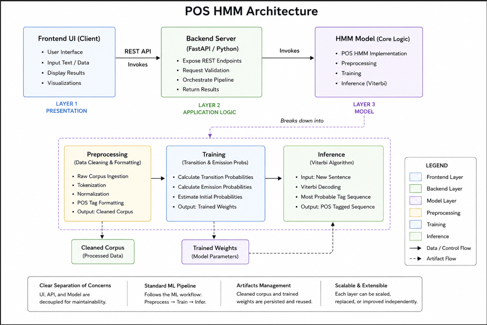

# POS Tagger HMM

A web-based Part-of-Speech (POS) Tagger application built using a Hidden Markov Model (HMM) trained on the Brown Corpus. The application provides a sleek UI for users to analyze the grammatical structure of English sentences.

## Screenshots & Architecture

