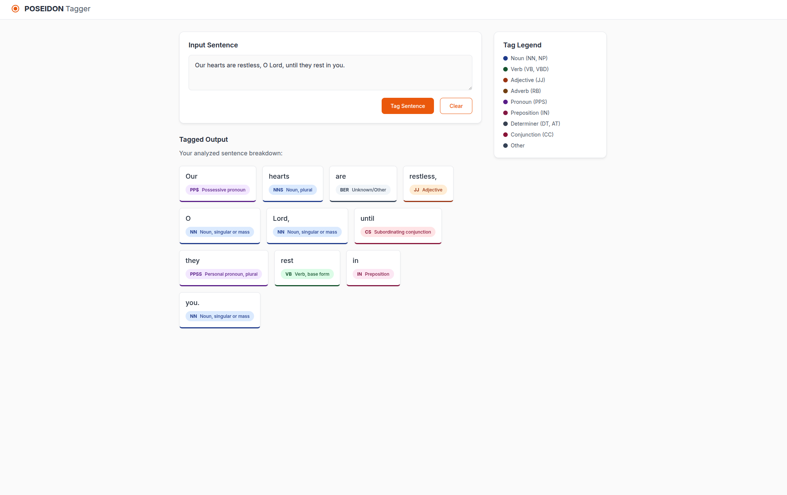

# POS Tagger HMM

A web-based Part-of-Speech (POS) Tagger application built using a Hidden Markov Model (HMM) trained on the Brown Corpus. The application provides a sleek UI for users to analyze the grammatical structure of English sentences.

## Screenshots




## Architecture

The application is structured into three main layers: Frontend, Backend, and the Core Model. The Model layer itself is resolved into a standard machine learning pipeline (Preprocessing -> Training -> Inference).

```mermaid
flowchart TB
    %% Layered Architecture Definitions
    subgraph "High-Level Layered Architecture"
        direction TB
        Frontend(" Frontend UI<br/>(Client)") 
        Backend(" Backend Server<br/>(FastAPI / Python)")
        ModelComponent(" HMM Model<br/>(Core Logic)")
        
        Frontend <-->|"REST API"| Backend
        Backend <-->|"Invokes"| ModelComponent
    end

    %% Resolving the Model Component
    subgraph "Model Pipeline Resolution"
        direction LR
        Preprocess(Preprocessing<br/>(Data Cleaning & Formatting))
        Train(Training<br/>(Transition & Emission Probs))
        Inference(Inference<br/>(Viterbi Algorithm))

        Preprocess -->|"Cleaned Corpus"| Train
        Train -->|"Trained Weights"| Inference
    end

    %% Connecting the High-level to the Resolution
    ModelComponent -.->|"Breaks down into"| Preprocess
    
    %% Styling
    classDef client fill:#ffcc80,stroke:#e65100,stroke-width:2px,color:#000;
    classDef server fill:#90caf9,stroke:#0d47a1,stroke-width:2px,color:#000;
    classDef model fill:#a5d6a7,stroke:#1b5e20,stroke-width:2px,color:#000;
    
    class Frontend client;
    class Backend server;
    class ModelComponent,Preprocess,Train,Inference model;
```

#
